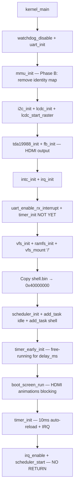

# 02 - Kernel Initialization

> **Phạm vi:** `kernel_main()` step-by-step từ khi trampoline nhảy vào đến khi `scheduler_start()` — không bao giờ return.
> **Yêu cầu trước:** [01-boot-and-bringup.md](01-boot-and-bringup.md) — hiểu entry.S trampoline.
> **Files liên quan:** `vinix-kernel/init/main.c`, `vinix-kernel/arch/arm/mm/mmu.c`, `vinix-kernel/drivers/`

---

## Initialization Sequence



> ⚠️ **Quan trọng — Thứ tự timer:** `timer_early_init()` (free-running cho `delay_ms`) phải chạy **TRƯỚC** `boot_screen_run()`. `timer_init()` (10ms auto-reload cho scheduler) chạy **SAU** boot screen. Đảo thứ tự sẽ phá vỡ animations và/hoặc scheduler.

---

## Step 1: Hardware Re-initialization

```c
watchdog_disable();
uart_init();
uart_printf("VinixOS: Interactive Shell\n");
```

> **Tại sao re-init:** Bootloader đã init nhưng kernel không assume bootloader state. Re-init đảm bảo consistent, known-good state.

---

## Step 2: MMU Phase B — Remove Identity Mapping

```c
mmu_init();
```

File: `vinix-kernel/arch/arm/mm/mmu.c`

```c
void mmu_init(void) {
    /* Remove identity mapping VA 0x80000000 → PA 0x80000000 */
    for (i = 0; i < BOOT_IDENTITY_MB; i++) {
        pa = BOOT_IDENTITY_PA + (i * MMU_SECTION_SIZE);
        pgd[pa >> MMU_SECTION_SHIFT] = 0;   /* Set to FAULT */
    }

    /* Flush TLB — invalidate cached translations */
    asm volatile(
        "mov r0, #0\n\t"
        "mcr p15, 0, r0, c8, c7, 0\n\t"    /* TLBIALL */
        "dsb\n\t"
        "isb\n\t"
    );

    /* Update VBAR: exception vectors phải point đến VA */
    uint32_t vbar_va = (uint32_t)&_boot_start + VA_OFFSET;
    asm volatile("mcr p15, 0, %0, c12, c0, 0\n\t isb\n\t" :: "r"(vbar_va));
}
```

**Tại sao remove identity mapping:**

| Lý Do | Chi Tiết |
|-------|---------|
| Giải phóng VA space | `0x80000000–0x87FFFFFF` trở thành unmapped (Translation Fault nếu access) |
| Enforce true VA usage | Code vô tình dereference PA thay vì VA → bị catch ngay |
| True 3G/1G split | User `0x40000000`, Kernel `0xC0000000` — rõ ràng, không overlap |

> ⚠️ **VBAR update:** Vector table vẫn ở PA `0x80000000` nhưng VBAR phải point đến VA `0xC0000000`. Nếu không update, exception handlers sẽ không resolve đúng.

---

## Step 3: Graphics Subsystem

```c
i2c_init();          /* I2C0 bus 100kHz — TDA19988 cần bus này   */
i2c_scan();          /* Diagnostic: enumerate I2C devices         */
lcdc_init();         /* Configure LCDC + Display PLL (40MHz)      */
lcdc_start_raster(); /* START pixel clock output → TDA cần clock này */
tda19988_init();     /* HDMI transmitter full init (cần pixel clock) */
fb_init();           /* Init framebuffer pointer từ LCDC          */
```

> ⚠️ **Thứ tự graphics là bắt buộc:**
> `lcdc_start_raster()` phải chạy **TRƯỚC** `tda19988_init()`.
> TDA19988 cần pixel clock có sẵn trên chân `LCD_PCLK` để lock TMDS PLL.
> Khác với U-Boot (đã start LCDC sẵn), VinixOS bare-metal phải tự quản lý thứ tự này.

---

## Step 4: Interrupt Infrastructure

```c
intc_init();                  /* Reset INTC, disable all 128 IRQs     */
irq_init();                   /* Init IRQ handler table (128 entries)  */
uart_enable_rx_interrupt();   /* Register + enable UART RX IRQ        */
```

> **Lưu ý:** IRQ vẫn **DISABLED** ở CPU level (I-bit trong CPSR) tại bước này. `irq_enable()` chỉ được gọi sau khi scheduler setup hoàn tất — xem Step 7.

**Initialization order quan trọng:**

| Thứ Tự | Function | Lý Do |
|--------|---------|-------|
| 1 | `intc_init()` | Hardware INTC phải reset trước |
| 2 | `irq_init()` | IRQ framework (handler table) cần init trước register |
| 3 | `uart_enable_rx_interrupt()` | Đăng ký handler + unmask IRQ tại INTC |

---

## Step 5: Filesystem

```c
vfs_init();

if (ramfs_init() != E_OK) {
    uart_printf("[BOOT] ERROR: Failed to initialize RAMFS\n");
    while (1);   /* Halt — không thể tiếp tục */
}

if (vfs_mount("/", ramfs_get_operations()) != E_OK) {
    uart_printf("[BOOT] ERROR: Failed to mount RAMFS at /\n");
    while (1);
}
```

- **VFS:** Abstraction layer, không biết filesystem cụ thể
- **RAMFS:** In-memory, read-only, files embed vào kernel lúc build
- **Mount point:** `"/"` — root filesystem cho tất cả file operations

---

## Step 6: Load User Payload

```c
uint32_t payload_size = &_shell_payload_end - &_shell_payload_start;
uint8_t *src = &_shell_payload_start;  /* Nằm trong .rodata */
uint8_t *dst = (uint8_t *)USER_SPACE_VA;  /* 0x40000000     */

for (uint32_t i = 0; i < payload_size; i++)
    dst[i] = src[i];
```

> **Tại sao copy thay vì execute tại chỗ:** Shell binary nằm trong `.rodata` (read-only). Copy sang `0x40000000` để layout khớp với linker script — `.data` và `.bss` cần writable memory tại đúng địa chỉ.

---

## Step 7: Scheduler Setup

```c
scheduler_init();

/* Idle Task — kernel mode, luôn READY */
struct task_struct *idle_ptr = get_idle_task();
scheduler_add_task(idle_ptr);

/* Shell Task — user mode, entry 0x40000000 */
shell_task.name  = "User App (Shell)";
shell_task.state = TASK_STATE_READY;
task_stack_init(&shell_task,
                (void (*)(void))USER_SPACE_VA,          /* entry point */
                (void *)(USER_STACK_BASE - USER_STACK_SIZE),
                USER_STACK_SIZE);
scheduler_add_task(&shell_task);
```

| Task | Mode | Entry | Stack |
|------|------|-------|-------|
| Idle | Kernel (SVC `0x13`) | `idle_task()` | Kernel SVC stack |
| Shell | User (`0x10`) | `0x40000000` | `0x40100000 - 4KB` |

> **`task_stack_init()`:** Setup initial stack frame với `LR = entry_point`, `SPSR = mode bits`. Khi context switch lần đầu, CPU restore SPSR → CPSR và jump đến LR — task bắt đầu execute đúng mode và đúng entry.

---

## Step 8: Boot Screen (HDMI)

```c
timer_early_init();    /* DMTimer2 free-running — cho delay_ms()      */
boot_screen_run();     /* Blocking: boot log + splash + home (~9 giây) */
timer_init();          /* DMTimer2 auto-reload 10ms + IRQ — scheduler  */
```

**Tại sao 2 bước timer:**

| Timer Mode | Function | Dùng Cho |
|-----------|---------|---------|
| Free-running | `timer_early_init()` | `delay_ms()` polling — boot screen animations |
| Auto-reload 10ms | `timer_init()` | Periodic IRQ → `scheduler_tick()` |

> ⚠️ **`timer_init()` PHẢI chạy sau `boot_screen_run()`:** `timer_init()` reconfigure DMTimer2 sang auto-reload mode — nếu chạy trước, `delay_ms()` sẽ hoạt động sai và animations bị hỏng.

---

## Step 9: Start Scheduler

```c
irq_enable();       /* Clear I-bit trong CPSR — CPU accept IRQ */
scheduler_start();  /* Load first task context — NEVER RETURNS */

while (1) {
    uart_printf("PANIC: Scheduler returned!\n");  /* Không bao giờ đến đây */
}
```

```c
static inline void irq_enable(void) {
    asm volatile("cpsie i" ::: "memory");
}
```

**`scheduler_start()` thực hiện:**
1. Mark Idle task là RUNNING
2. Load task context (registers, SP, SPSR)
3. `movs pc, lr` → restore CPSR từ SPSR → jump đến entry point
4. **NEVER RETURNS**

> Từ đây trở đi, kernel code chỉ execute trong exception context (IRQ, SVC, Abort). `kernel_main()` không bao giờ được gọi lại.

---

## Initialization Checklist

Trước `scheduler_start()`, phải đảm bảo tất cả:

| # | Điều Kiện | Đảm Bảo Bởi |
|---|-----------|------------|
| 1 | MMU enable và identity map đã remove | `mmu_init()` |
| 2 | VBAR point đến VA | `mmu_init()` |
| 3 | INTC initialized | `intc_init()` |
| 4 | UART RX interrupt ready | `uart_enable_rx_interrupt()` |
| 5 | Timer configured 10ms tick | `timer_init()` |
| 6 | VFS mounted | `vfs_mount()` |
| 7 | User payload loaded | memcpy loop |
| 8 | Ít nhất 1 task trong scheduler | `scheduler_add_task()` |
| 9 | IRQ enabled tại CPU | `irq_enable()` |

---

## Tóm Tắt

| Concept | Ý Nghĩa |
|---------|---------|
| Initialization order matters | Hardware dependencies phải respect — INTC trước timer, graphics theo đúng thứ tự |
| MMU Phase B | Remove identity map để enforce true VA usage và catch PA dereference bugs |
| Two-phase timer | `timer_early_init` (free-run) cho animations; `timer_init` (auto-reload) cho scheduler |
| IRQ enable timing | Enable **sau** tất cả interrupt infrastructure sẵn sàng, **trước** scheduler start |
| User payload copy | Từ kernel `.rodata` sang `0x40000000` — cần writable memory cho user `.data/.bss` |
| `scheduler_start()` = one-way | Sau khi gọi, system chạy hoàn toàn trong task context — kernel_main không return |
| No dynamic allocation | Tất cả structures (tasks, stacks) là static — đơn giản và predictable |

---

## Xem Thêm

- [01-boot-and-bringup.md](01-boot-and-bringup.md) — entry.S trampoline trước khi kernel_main
- [03-memory-and-mmu.md](03-memory-and-mmu.md) — chi tiết MMU Phase A/B
- [04-interrupt-and-exception.md](04-interrupt-and-exception.md) — INTC và IRQ framework
- [05-task-and-scheduler.md](05-task-and-scheduler.md) — context switch và scheduling
