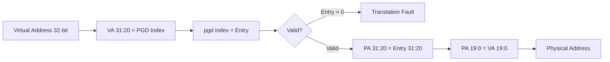

# 03 - Memory Management và MMU

> **Phạm vi:** ARMv7-A MMU configuration, L1 page table, address translation, và memory layout chi tiết — từ Phase A (boot) đến Phase B (runtime).
> **Yêu cầu trước:** [01-boot-and-bringup.md](01-boot-and-bringup.md) — MMU được enable trong entry.S.
> **Files liên quan:** `vinix-kernel/arch/arm/mm/mmu.c`, `vinix-kernel/arch/arm/mm/mmu_enable.S`, `vinix-kernel/arch/arm/kernel.ld`

---

## Kiến Trúc MMU ARMv7-A

### 1-Level Page Table (Section Descriptors)

VinixOS dùng **1-level page table** với **section descriptors** — mỗi entry map 1 MB:

```
L1 Page Global Directory (PGD):
  - 4096 entries × 4 bytes = 16 KB (phải align 16 KB)
  - Entry index = VA[31:20] (12 bits cao)
  - Mỗi entry map 1 MB VA → 1 MB PA
```

**Section Descriptor Format (32-bit):**

| Bits | Tên | Ý Nghĩa |
|------|-----|---------|
| [31:20] | Base Address | PA[31:20] — địa chỉ vật lý của 1 MB section |
| [11:10] | AP[1:0] | Access Permissions — User/Kernel RW/RO |
| [8:5] | Domain | Domain number (VinixOS dùng Domain 0) |
| [4] | XN | Execute Never — cấm execute (không dùng) |
| [3:2] | C, B | Cacheable, Bufferable |
| [1:0] | Type | `10` = Section descriptor |

> **Tại sao 1-level:** Đơn giản hơn 2-level (không cần L2 page tables). 1 MB granularity đủ cho embedded OS. Performance tốt hơn — ít TLB misses hơn (1 entry cover 1 MB thay vì 4 KB).

---

## Physical Memory Map

| Địa Chỉ PA | Size | Nội Dung |
|------------|------|---------|
| `0x00000000` – `0x001FFFFF` | 2 MB | Boot ROM |
| `0x402F0000` – `0x4030FFFF` | 128 KB | Internal SRAM (MLO) |
| `0x44E00000` – `0x44E0FFFF` | 64 KB | L4\_WKUP: UART0, CM\_PER, WDT1 |
| `0x44E10000` – `0x44E1FFFF` | 64 KB | Control Module |
| `0x48000000` – `0x482FFFFF` | 3 MB | L4\_PER: INTC, Timer, GPIO |
| `0x4C000000` – `0x4C000FFF` | 4 KB | EMIF (DDR3 Controller) |
| `0x80000000` – `0x9FFFFFFF` | 512 MB | DDR3 RAM |

---

## Virtual Memory Map

### Sau `mmu_init()` — Final State

| VA Range | Size | → PA | AP | Cache | Ghi Chú |
|----------|------|------|----|-------|---------|
| `0x40000000–0x40FFFFFF` | 16 MB | `0x80000000` | User RW | Write-back | User space (Shell) |
| `0xC0000000–0xC7FFFFFF` | 128 MB | `0x80000000` | Kernel only | Write-back | Kernel space |
| `0x44E00000–0x44E0FFFF` | 64 KB | `0x44E00000` | Kernel only | Strongly Ordered | L4\_WKUP identity |
| `0x48000000–0x482FFFFF` | 3 MB | `0x48000000` | Kernel only | Strongly Ordered | L4\_PER identity |
| Còn lại | — | — | — | — | Unmapped → Translation Fault |

> **Shared physical memory:** User space (`0x40000000`) và Kernel space (`0xC0000000`) đều map về cùng `PA 0x80000000`. Đây là simplification của reference OS — production OS dùng separate physical pages per process.

---

## Section Descriptor Flags

File: `vinix-kernel/arch/arm/mm/mmu.c`

```c
/* Kernel RAM: Cached, Kernel-only (AP=01) */
#define MMU_SECT_KERNEL_RAM  (0x00000002       \  /* Type = Section      */
                            | (0x1 << 10)       \  /* AP=01: Kernel RW    */
                            | (0x0 << 5)        \  /* Domain 0            */
                            | (0x1 << 3)        \  /* C=1 Cacheable       */
                            | (0x1 << 2))          /* B=1 Bufferable      */

/* User RAM: Cached, User+Kernel RW (AP=11) */
#define MMU_SECT_USER_RAM    (0x00000002       \
                            | (0x3 << 10)       \  /* AP=11: User RW      */
                            | (0x0 << 5)        \
                            | (0x1 << 3)        \
                            | (0x1 << 2))

/* Peripheral: Strongly Ordered, Kernel-only */
#define MMU_SECT_PERIPHERAL  (0x00000002       \
                            | (0x1 << 10)       \  /* AP=01: Kernel only  */
                            | (0x0 << 5)        \
                            | (0x0 << 3)        \  /* C=0 Non-cacheable   */
                            | (0x0 << 2))          /* B=0 Non-bufferable  */
```

**Access Permissions (AP bits):**

| AP[1:0] | Kernel | User | Dùng Cho |
|---------|--------|------|---------|
| `01` | RW | No Access | Kernel RAM, Peripherals |
| `11` | RW | RW | User RAM |

**Cache Policy:**

| Region | C | B | Policy | Lý Do |
|--------|---|---|--------|-------|
| RAM | 1 | 1 | Write-back cached | Performance |
| Peripherals | 0 | 0 | Strongly Ordered | Mỗi access phải hit hardware — không cache, không reorder |

> ⚠️ **Peripherals phải Strongly Ordered:** Nếu cache register reads → stale values. Nếu reorder writes → sai hardware state. Strongly Ordered đảm bảo mỗi `readl/writel` là atomic và in-order.

---

## Page Table Build — Phase A

Function: `mmu_build_page_table_boot()` — chạy tại PA trước enable MMU.

```c
void mmu_build_page_table_boot(uint32_t *pgd_pa) {
    /* 1. Clear toàn bộ — fault tất cả VA */
    for (i = 0; i < 4096; i++) pgd_pa[i] = 0;

    /* 2. Peripheral identity maps */
    for (i = 0; i < PERIPH_L4_WKUP_SECTIONS; i++) {
        pa = 0x44E00000 + i * 0x100000;
        pgd_pa[pa >> 20] = pa | MMU_SECT_PERIPHERAL;
    }
    for (i = 0; i < PERIPH_L4_PER_SECTIONS; i++) {
        pa = 0x48000000 + i * 0x100000;
        pgd_pa[pa >> 20] = pa | MMU_SECT_PERIPHERAL;
    }

    /* 3. User Space: VA 0x40000000 → PA 0x80000000 */
    for (i = 0; i < USER_SPACE_MB; i++) {
        pa     = 0x80000000 + i * 0x100000;
        va_idx = (0x40000000 + i * 0x100000) >> 20;
        pgd_pa[va_idx] = pa | MMU_SECT_USER_RAM;
    }

    /* 4. Kernel: VA 0xC0000000 → PA 0x80000000 */
    for (i = 0; i < KERNEL_DDR_MB; i++) {
        pa     = 0x80000000 + i * 0x100000;
        va_idx = (0xC0000000 + i * 0x100000) >> 20;
        pgd_pa[va_idx] = pa | MMU_SECT_KERNEL_RAM;
    }

    /* 5. Temporary identity map: VA 0x80000000 → PA 0x80000000 */
    for (i = 0; i < BOOT_IDENTITY_MB; i++) {
        pa = 0x80000000 + i * 0x100000;
        pgd_pa[pa >> 20] = pa | MMU_SECT_KERNEL_RAM;
    }
}
```

> **Index calculation:** `va_idx = VA >> 20` — shift phải 20 bits để lấy entry index (VA[31:20]).

> **Tại sao cần identity map (Step 5):** Sau khi enable MMU, CPU vẫn đang execute tại PA `0x80000000`. Identity map đảm bảo instruction fetch vẫn work. Sẽ bị remove bởi `mmu_init()` sau trampoline.

---

## MMU Enable Sequence

Function: `mmu_enable()` — File: `vinix-kernel/arch/arm/mm/mmu_enable.S`

```c
void mmu_enable(uint32_t *pgd_base) {
    /* 1. TTBR0 — Translation Table Base Register */
    asm volatile("mcr p15, 0, %0, c2, c0, 0" :: "r"(pgd_base));

    /* 2. DACR — Domain Access Control Register
     *    Domain 0 = CLIENT (enforce AP bits) */
    uint32_t dacr = 0x00000001;
    asm volatile("mcr p15, 0, %0, c3, c0, 0" :: "r"(dacr));

    /* 3. SCTLR — System Control Register, set M bit */
    uint32_t sctlr;
    asm volatile("mrc p15, 0, %0, c1, c0, 0" : "=r"(sctlr));
    sctlr |= 0x1;   /* M bit = Enable MMU */
    asm volatile("mcr p15, 0, %0, c1, c0, 0" :: "r"(sctlr));

    /* 4. ISB — pipeline flush */
    asm volatile("isb");
}
```

**CP15 Registers sử dụng:**

| Register | CP15 Address | Chức Năng |
|----------|-------------|----------|
| TTBR0 | `c2, c0, 0` | Page table base address |
| DACR | `c3, c0, 0` | Domain access control |
| SCTLR | `c1, c0, 0` | System control (MMU enable bit 0) |
| VBAR | `c12, c0, 0` | Vector base address register |
| TLBIALL | `c8, c7, 0` | Invalidate entire TLB |

---

## Remove Identity Map — Phase B

Function: `mmu_init()` — gọi từ `kernel_main()` sau trampoline.

```c
void mmu_init(void) {
    /* Set identity map entries to FAULT (0) */
    for (i = 0; i < BOOT_IDENTITY_MB; i++) {
        pa = 0x80000000 + i * 0x100000;
        pgd[pa >> 20] = 0;
    }

    /* Flush TLB — xóa cached translations */
    asm volatile(
        "mov r0, #0\n\t"
        "mcr p15, 0, r0, c8, c7, 0\n\t"   /* TLBIALL */
        "dsb\n\t"
        "isb\n\t"
    );

    /* Update VBAR → VA */
    uint32_t vbar_va = (uint32_t)&_boot_start + VA_OFFSET;
    asm volatile("mcr p15, 0, %0, c12, c0, 0\n\t isb\n\t" :: "r"(vbar_va));
}
```

> ⚠️ **TLB flush bắt buộc:** TLB cache translations. Sau khi modify page table PHẢI flush TLB, nếu không CPU dùng stale (outdated) translations.

---

## Address Translation



**Ví dụ cụ thể:** Translate VA `0xC0001234`

```
1. Index = 0xC0001234 >> 20 = 0xC00 = 3072
2. PGD[3072] = 0x80000C0E
   - PA base = 0x80000000
   - Flags   = 0xC0E (Section, Cached, Kernel-only)
3. PA = 0x80000000 | (0xC0001234 & 0x000FFFFF)
      = 0x80001234
```

**Permission Check khi CPU access memory:**

| Bước | Kiểm Tra | Fault Nếu |
|------|---------|----------|
| 1 | Translation valid? | Entry = 0 → Translation Fault |
| 2 | Domain access? | DACR[D0] = NO\_ACCESS → Domain Fault |
| 3 | AP check? | User mode access Kernel-only → Permission Fault |

---

## Kernel Space Layout Chi Tiết

```
0xC0000000  ┌─────────────────────┐
            │  Exception Vectors   │  4 KB
0xC0001000  ├─────────────────────┤
            │  .text (kernel code) │
            ├─────────────────────┤
            │  .rodata             │  (shell payload embed ở đây)
            ├─────────────────────┤
            │  .data               │
            ├─────────────────────┤
            │  .bss                │
            ├─────────────────────┤
0xC0100000  │  Kernel Stacks       │  64 KB total
            │    SVC stack: 16 KB  │
            │    IRQ stack: 16 KB  │
            │    ABT stack: 16 KB  │
            │    UND stack:  8 KB  │
            │    FIQ stack:  8 KB  │
0xC0110000  ├─────────────────────┤
            │  (Kernel heap)       │  future use
0xC7FFFFFF  └─────────────────────┘
```

---

## Key Design Decisions

| Decision | Rationale | Trade-off |
|----------|-----------|-----------|
| **1-level page table** | Đơn giản, không cần L2 tables; 1 MB granularity đủ | Waste physical memory nếu chỉ dùng vài KB trong 1 MB section |
| **True 3G/1G split** (`0x40000000`/`0xC0000000`) | Clear separation; catch cross-boundary access bugs | User space chỉ có 16 MB (đủ cho reference OS) |
| **Shared physical memory** | Không cần memory allocator; kernel access user memory trực tiếp | Không isolate physical memory giữa user/kernel |
| **Static page table** | Không cần dynamic mapping; predictable layout | Không support process creation, mmap, demand paging |

---

## Common Pitfalls

> ⚠️ **Quên TLB flush:** Modify page table mà không flush TLB → CPU dùng stale translation → data corruption hoặc access sai vùng memory.

> ⚠️ **Sai cache policy cho peripheral:** Cache peripheral registers → stale reads, lost writes. Luôn dùng Strongly Ordered (C=0, B=0) cho MMIO.

> ⚠️ **Identity mapping leak:** Quên remove identity map → code có thể accidentally dereference PA. Fix: `mmu_init()` gọi ngay sau trampoline.

> ⚠️ **VBAR không update:** VBAR vẫn point PA sau enable MMU → exception vectors không resolve → system crash khi có exception.

---

## Tóm Tắt

| Concept | Ý Nghĩa |
|---------|---------|
| 1-level page table | 4096 entries × 4B = 16 KB; mỗi entry map 1 MB; index = VA[31:20] |
| Two-phase MMU | Phase A (boot): enable với identity map; Phase B (runtime): remove identity map |
| Translation transparent | Sau enable MMU, tất cả access đều qua MMU — code không cần aware |
| Cache policy matters | RAM: write-back cached; Peripherals: Strongly Ordered |
| TLB is a cache | Phải flush sau modify page table |
| AP bits enforce isolation | User mode không thể access kernel VA (AP=01) → Permission Fault |
| 1 MB granularity | Đủ cho embedded OS; ít TLB misses hơn 4 KB pages |

---

## Xem Thêm

- [01-boot-and-bringup.md](01-boot-and-bringup.md) — MMU Phase A trong entry.S
- [02-kernel-initialization.md](02-kernel-initialization.md) — MMU Phase B trong kernel_main
- [04-interrupt-and-exception.md](04-interrupt-and-exception.md) — VBAR và exception vectors
- [08-userspace-application.md](08-userspace-application.md) — user space memory layout
