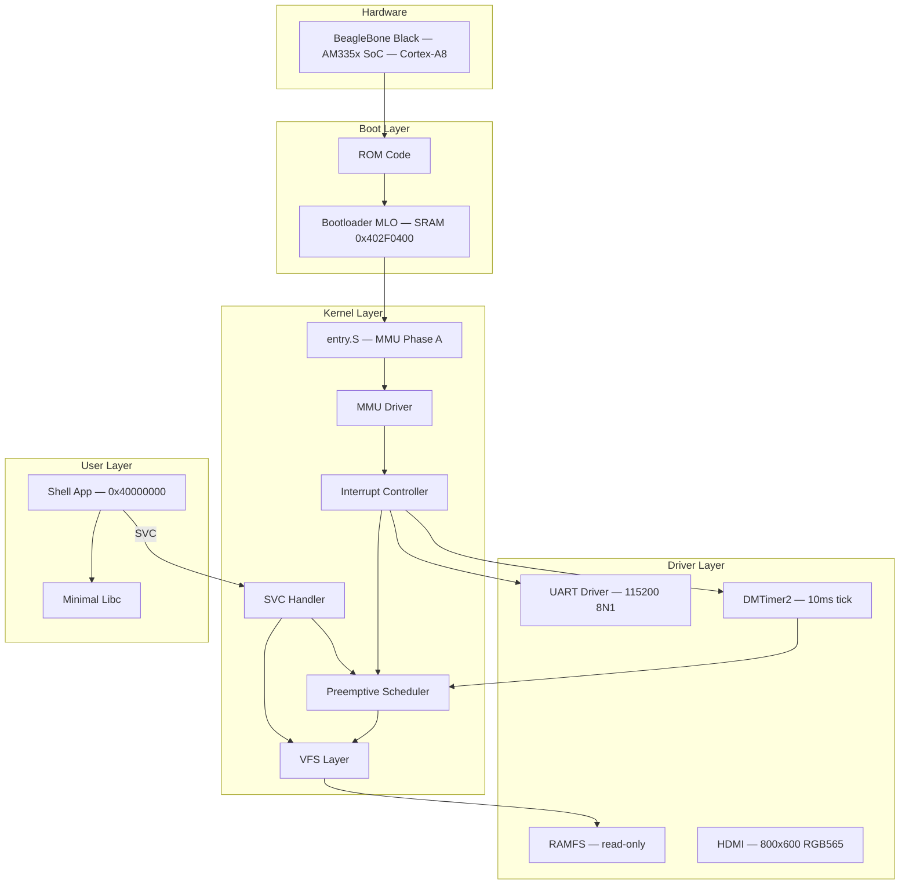
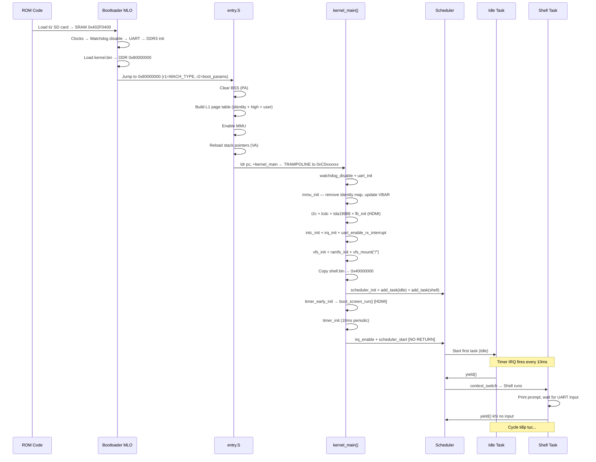
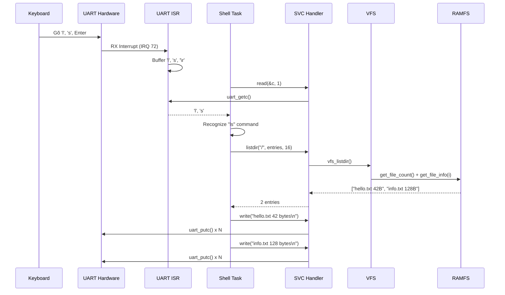

# 99 - System Overview

> **Phạm vi:** Bức tranh toàn cảnh — kiến trúc tổng thể, boot-to-shell flow, data flows, memory map đầy đủ, design principles, và documentation reading guide.
> **Yêu cầu trước:** Đọc file này trước hoặc sau khi đọc toàn bộ docs 01-08. Là tài liệu tham chiếu tổng hợp.
> **Files liên quan:** Tất cả files trong project.

---

## Kiến Trúc Tổng Thể



---

## Boot-to-Shell Flow Đầy Đủ



---

## Data Flow: User Gõ "ls" → Output



---

## Memory Map Đầy Đủ

### Physical Memory

| Địa Chỉ PA | Size | Mô Tả |
|------------|------|--------|
| `0x00000000` – `0x001FFFFF` | 2 MB | Boot ROM |
| `0x402F0000` – `0x4030FFFF` | 128 KB | Internal SRAM — MLO load ở đây |
| `0x44E00000` – `0x44E0FFFF` | 64 KB | L4\_WKUP Peripherals (UART0, WDT, CM\_PER) |
| `0x48000000` – `0x482FFFFF` | 3 MB | L4\_PER Peripherals (INTC, Timer, GPIO) |
| `0x4C000000` – `0x4C000FFF` | 4 KB | EMIF — DDR3 Controller |
| `0x80000000` – `0x9FFFFFFF` | 512 MB | DDR3 RAM — kernel + user |

### Virtual Memory (Sau `mmu_init()`)

| VA Range | Size | → PA | Access | Cache | Ghi chú |
|----------|------|-------|--------|-------|---------|
| `0x00000000` – `0x3FFFFFFF` | 1 GB | — | — | — | Unmapped → Translation Fault |
| `0x40000000` – `0x40FFFFFF` | 16 MB | `0x80000000` | User RW, Kernel RW | Cached | User Space — Shell |
| `0x41000000` – `0xBFFFFFFF` | — | — | — | — | Unmapped |
| `0xC0000000` – `0xC7FFFFFF` | 128 MB | `0x80000000` | Kernel only | Cached | Kernel Space |
| `0x44E00000` – `0x44E0FFFF` | 64 KB | `0x44E00000` | Kernel only | Strongly Ordered | L4\_WKUP identity |
| `0x48000000` – `0x482FFFFF` | 3 MB | `0x48000000` | Kernel only | Strongly Ordered | L4\_PER identity |

> **Lưu ý:** User và Kernel **share physical memory** (`PA 0x80000000`) nhưng có VA ranges hoàn toàn tách biệt. Đây là trade-off chủ ý của reference OS — production OS sẽ dùng separate physical pages.

---

## Component Interactions

### 1. Timer → Scheduler → Tasks

```text
DMTimer2 Hardware (overflow mỗi 10ms)
    ↓ IRQ 68
INTC (route đến CPU)
    ↓ IRQ exception
irq_handler_entry.S (save context vào SVC stack)
    ↓
irq_handler() → timer_handler()
    ↓
scheduler_tick() → set need_reschedule = true
    ↓ return from IRQ
Task đang chạy kiểm tra need_reschedule
    ↓
scheduler_yield() → context_switch(current, next)
    ↓
Task tiếp theo chạy
```

### 2. Shell Write → UART Output

```text
Shell: write("hello\n", 6)           ← User Mode 0x40000000
    ↓ r7=SYS_WRITE, svc #0
SVC exception → SVC mode
    ↓
svc_handler_entry.S (save r0-r12, SPSR)
    ↓
svc_handler() → sys_write()
    ↓ validate pointer [0x40000000–0x40FFFFFF]
uart_putc() × 6
    ↓ write to UART TX register 0x44E09000
UART Hardware transmit bytes
    ↓ return
RFEIA → restore CPSR → User Mode
Shell tiếp tục chạy
```

### 3. File Access (open → read → close)

```text
open("/hello.txt")
    → SVC → vfs_open() → ramfs_lookup("hello.txt") → file_index=0
    → Allocate FD=3, offset=0
    → Return FD=3

read_file(3, buf, 256)
    → SVC → vfs_read(3) → ramfs_read(0, offset=0)
    → memcpy từ .rodata (kernel image)
    → Update FD offset
    → Return bytes_read

close(3)
    → SVC → vfs_close(3) → fd_table[3].in_use = false
```

---

## Design Principles

| Principle | Quyết Định Cụ Thể | Rationale |
|-----------|------------------|-----------|
| **Simplicity over features** | 1-level page table, round-robin scheduler, static task array, RAMFS read-only | Reference OS để học — simplicity giúp hiểu concepts |
| **Correctness over performance** | Flush TLB toàn bộ, no nested interrupts, cooperative yield trong preemptive scheduler | Correct code dễ optimize sau; incorrect code khó debug |
| **Explicit over implicit** | Explicit MMU setup, explicit stack reload, explicit pointer validation, explicit TLB flush | Explicit code dễ understand và debug |
| **Isolation over sharing** | True 3G/1G split (0x40000000/0xC0000000), MMU enforce boundary, syscall-only kernel access | Isolation ngăn bugs và security issues |

---

## Thành Tựu Đạt Được

| # | Thành Tựu | Chi Tiết |
|---|-----------|---------|
| ✅ 1 | Boot hoàn chỉnh | ROM → Bootloader → Kernel → Tasks, trên phần cứng thật |
| ✅ 2 | Virtual memory | MMU với user/kernel separation, 3G/1G split |
| ✅ 3 | Exception handling | 7 exception types, vector table, INTC |
| ✅ 4 | Preemptive multitasking | Timer-driven scheduler, context switch, 10ms tick |
| ✅ 5 | Syscall interface | AAPCS-compliant, pointer validation, 11 syscalls |
| ✅ 6 | Filesystem | VFS abstraction + RAMFS, build-time file embedding |
| ✅ 7 | User space isolation | Shell ở User Mode, tách biệt hoàn toàn kernel |
| ✅ 8 | HDMI display | 800×600 RGB565, boot log + splash + home screen |
| ✅ 9 | Interactive shell | UART input, `ls`, `cat`, `ps`, `meminfo`, `help` |

---

## Limitations (By Design)

| # | Limitation | Lý Do |
|---|-----------|-------|
| 1 | Single core | Không support SMP |
| 2 | No dynamic memory | Tất cả static allocation — không có `malloc/free` |
| 3 | MAX_TASKS = 4 | Fixed task array |
| 4 | RAMFS read-only | Files embed lúc build, không ghi runtime |
| 5 | No process creation | Tasks fixed lúc boot, không có `fork/exec` |
| 6 | Static page table | Không có dynamic mmap, không có demand paging |
| 7 | No networking | Không có network stack |
| 8 | No power management | Không có sleep/suspend |
| 9 | Shared physical memory | User và kernel dùng chung PA `0x80000000` |

> Đây là **reference OS** cho mục đích học tập, không phải production. Các limitations này giữ code đơn giản và focused vào concepts.

---

## Hướng Dẫn Đọc Docs

| Thứ Tự | File | Nội Dung | Đọc Khi Nào |
|--------|------|---------|------------|
| 1 | [01-boot-and-bringup](01-boot-and-bringup.md) | ROM → MLO → entry.S → kernel_main | Bắt đầu từ đây |
| 2 | [02-kernel-initialization](02-kernel-initialization.md) | kernel_main() step-by-step | Sau khi hiểu boot |
| 3 | [03-memory-and-mmu](03-memory-and-mmu.md) | MMU, page table, address translation | Cần cho mọi phần khác |
| 4 | [04-interrupt-and-exception](04-interrupt-and-exception.md) | Exception types, INTC, IRQ flow | Trước khi đọc scheduler |
| 5 | [05-task-and-scheduler](05-task-and-scheduler.md) | Context switch, round-robin, timer | Sau interrupt |
| 6 | [06-syscall-mechanism](06-syscall-mechanism.md) | SVC ABI, pointer validation, syscalls | Trước khi đọc userspace |
| 7 | [08-userspace-application](08-userspace-application.md) | crt0, linker script, shell, privilege | Sau khi hiểu syscalls |
| 8 | [10-p7-networking-handoff](10-p7-networking-handoff.md) | Networking module handoff (CPSW + UDP/ICMP/ARP) | Độc lập |
| 9 | [99-system-overview](99-system-overview.md) | Big picture, flows, memory map | File này — bất kỳ lúc nào |

---

## Future Extensions (Phase 2+)

1. **Self-hosted Compiler (VinCC)** — compiler output chạy trực tiếp trên VinixOS
2. **Dynamic Process Creation** — `exec()` load ELF từ filesystem
3. **Writable Filesystem** — FAT32 hoặc simple writable FS
4. **Memory Allocator** — `malloc/free` implementation
5. **More Syscalls** — `fork`, `pipe`, `mmap`, socket
6. **SMP Support** — multi-core scheduler
7. **More Drivers** — GPIO, SPI, USB

---

## Xem Thêm

- [01-boot-and-bringup.md](01-boot-and-bringup.md) — chi tiết boot sequence
- [03-memory-and-mmu.md](03-memory-and-mmu.md) — memory layout chi tiết
- [CLAUDE.md](../../CLAUDE.md) — project guide cho AI-assisted development
