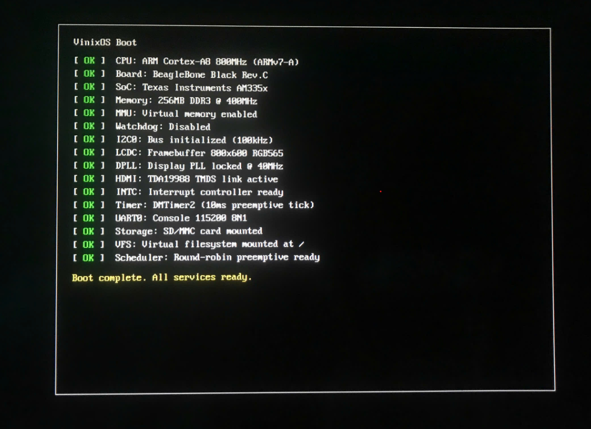
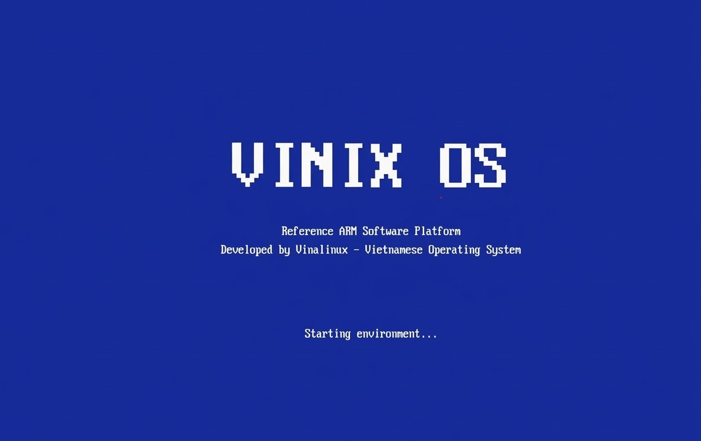
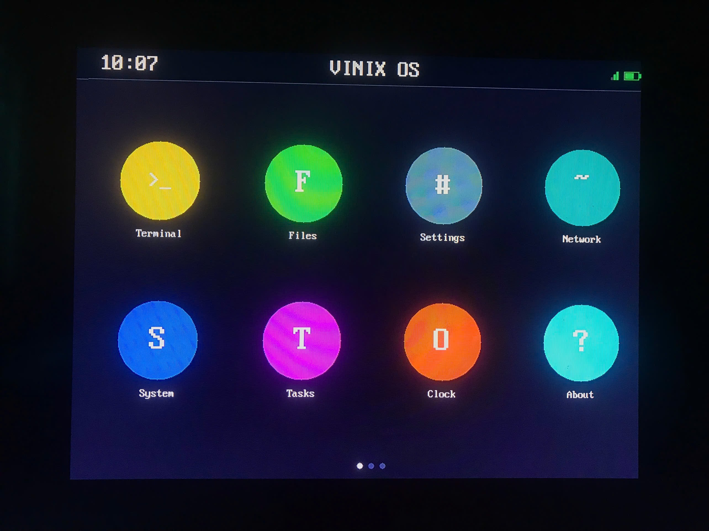

# VinixOS — Bare-metal ARM Operating System

**Bare-metal operating system + cross-compiler cho ARMv7-A, chạy trên phần cứng thật (BeagleBone Black).**

Được phát triển bởi **Vinalinux** như một reference platform 100% tự viết — kernel, libc, userspace, compiler. Không dựa trên Linux/Unix/BSD; không fork/port upstream; không emulator. Mọi dòng code trong repo đều tự tay gõ, hiểu, chịu trách nhiệm.

---

## Screenshots

### Boot Log



### Splash Screen



### Home Screen



---

## Tổng Quan

Project gồm 2 components chính:

| Component | Mô Tả | Ngôn Ngữ |
|-----------|-------|---------|
| **VinixOS** | Bare-metal OS: bootloader, kernel, userspace shell, HDMI display | C, ARM Assembly |
| **VinCC** | Cross-compiler: Subset C → ARMv7-A ELF binary | Python |

---

## VinixOS — Hệ Điều Hành

### Bootloader (MLO)

- Khởi tạo hardware: clocks, watchdog, DDR3 memory, UART
- Load kernel từ SD card (sector 2048) vào DDR3 `0x80000000`
- Jump sang kernel với ARM boot parameters (r1 = MACH\_TYPE)

### Kernel

| Subsystem | Chi Tiết |
|-----------|---------|
| **HAL 4 lớp** | `kernel/` generic · `arch/arm/` ARMv7 CPU · `platform/bbb/` AM3358 board · `drivers/` device impls |
| **MMU** | 3G/1G split: User VA `0x40000000` (1 MB, per-process L2 + TTBR0), Kernel VA `0xC0000000` (L1 section) |
| **Memory** | Bitmap page allocator (112 MB pool), slab (`kmem_cache_*`), `kmalloc(GFP_KERNEL)`, VMM (`mm_struct`, `vm_area_struct`) |
| **Concurrency** | `spinlock_t` (LDREX/STREX), `atomic_t`, `wait_queue_head_t`, `wait_event`/`wake_up`, blocking I/O |
| **Exception** | 7 types, INTC 128 IRQ, DFSR/DFAR decode, user fault → SIGSEGV (kernel sống), kernel fault → PANIC dump |
| **Scheduler** | Preemptive round-robin, 10 ms tick (DMTimer2), MAX_TASKS = 5, context switch ARM asm + TTBR0 swap |
| **Process** | `fork`/`exec`/`wait`/`exit`/`kill`, ELF loader, per-process fd table, `task_struct`, `current` |
| **Syscalls** | 22 syscall qua SVC, AAPCS ABI, `copy_from/to_user`, negative errno |
| **VFS** | Multi-FS: FAT32 rootfs (subdir/unlink/rename) + devfs (`/dev/tty`, `/dev/null`) + procfs (`/proc/...`) |
| **Block** | `block_device` abstraction, LRU buffer cache 64×512 B write-back |
| **Driver model** | Linux-style `platform_device/driver`, bus matching, `platform_get_resource` |
| **Userspace** | init (PID 1) + shell fork+exec + 10 external coreutils + vinixlibc POSIX subset (~1.4 KLOC) |
| **HDMI Display** | 800×600 RGB565, TDA19988 HDMI transmitter qua I2C, LCDC framebuffer |

### HDMI Graphics Stack

```
Framebuffer API (fb.c)  ←  800×600 RGB565, font 8×16, fb_fillcircle
        ↓
LCDC Driver (AM335x)    ←  Raster mode, 40MHz pixel clock (DPLL)
        ↓
TDA19988 (I2C-controlled) ←  HDMI transmitter, TMDS output
        ↓
HDMI Output 800×600@60Hz
```

**Boot screen sequence:**
1. **Boot Log** — 16 hardware init steps với `[ OK ]` indicators, animation 300ms/dòng
2. **Splash** — "VINIX OS" scale-6, animated dots, ~4.5 giây
3. **Home Launcher** — status bar (clock, wifi, battery), app icon grid 4×2, page dots

### Userspace

- **init** (PID 1) — respawn loop, fork+exec `/bin/sh`, reap zombie
- **shell** (`/bin/sh`) — fork+exec external ELF, built-ins (`cd`, `pwd`, `help`, `exit`), redirect `>` `<` `>>`, auto-prepend `/bin/` cho command không có `/`
- **Coreutils** — 10 ELFs trên `/bin/`: `ls cat echo ps kill pwd free uname rm mv` (mỗi utility ~30–150 LOC, link vinixlibc)
- **vinixlibc** — POSIX subset ~1.4 KLOC: `string.h`, `stdio.h` (printf family + FILE), `stdlib.h` (K&R free-list malloc), `unistd.h`, `fcntl.h`, `ctype.h`, `errno.h`, `signal.h`, `sys/stat.h`, `sys/wait.h`
- **crt0.S** — argv passthrough, BSS clear, call `main(argc, argv)`, `sys_exit(rc)` fallback

---

## VinCC — Cross Compiler

Compiler viết bằng Python, compile **Subset C** → **ARMv7-A ELF32 binary** chạy trên VinixOS.

### Pipeline

```
Source (.c) → [Lexer] → [Parser] → [Semantic] → [IR Gen] → [Codegen] → [Assembler] → [Linker] → ELF
```

| Phase | Module | Output |
|-------|--------|--------|
| Lexer | `frontend.lexer` | Token stream |
| Parser | `frontend.parser` | AST |
| Semantic Analyzer | `frontend.semantic` | Annotated AST + Symbol Table |
| IR Generator | `middleend.ir` | Three-Address Code (3AC) |
| Code Generator | `backend.armv7a` | ARM Assembly (.s) |
| Assembler | wraps `arm-linux-gnueabihf-as` | Object file (.o) |
| Linker | wraps `arm-linux-gnueabihf-ld` | ELF32 binary |

### Subset C Support

| Category | Features |
|----------|---------|
| Types | `int` (32-bit), `char` (8-bit), `void`, pointers (`int*`, `char*`), 1D arrays |
| Control Flow | `if/else`, `while`, `for`, `return` |
| Functions | Definition, call, recursion (max 4 params via r0-r3) |
| Operators | Arithmetic, comparison, logical, bitwise, assignment |

---

## Hardware

| Component | Spec |
|-----------|------|
| Board | BeagleBone Black Rev.C |
| SoC | Texas Instruments AM335x |
| CPU | ARM Cortex-A8 @ 800 MHz (ARMv7-A) |
| RAM | 512 MB DDR3 @ 400 MHz |
| Storage | microSD card |
| Display | HDMI via TDA19988 (800×600@60Hz) |
| Console | UART0 @ 115200 8N1 |

---

## Yêu Cầu Hệ Thống

### Phần Cứng

- **BeagleBone Black** (~$60)
- **microSD card** ≥ 128 MB
- **USB-to-Serial adapter** (3.3V TTL) — GND, RX, TX — cho UART console
- **HDMI monitor** — để xem boot screen và home launcher
- **5V/2A power supply**

### Phần Mềm

**OS**: Ubuntu 22.04 LTS (khuyến nghị)

**Dependencies**:

```bash
sudo apt-get update
sudo apt-get install -y \
    gcc-arm-none-eabi binutils-arm-none-eabi \
    binutils-arm-linux-gnueabihf \
    python3 python3-pip \
    build-essential make git \
    screen minicom
```

Kiểm tra cài đặt thành công:

```bash
arm-none-eabi-gcc --version        # Cross-compiler cho kernel
arm-linux-gnueabihf-as --version   # Assembler cho VinCC runtime
python3 --version                  # Python cho VinCC compiler
```

Nếu dùng serial console, thêm user vào group `dialout` (cần logout/login lại):

```bash
sudo usermod -a -G dialout $USER
```

---

## Cài Đặt và Build

### Phần A — Cài Đặt VinixOS

#### Bước 1: Clone

```bash
git clone https://github.com/Vinalinux-Org/Vinix-OS.git
cd Vinix-OS
```

#### Bước 2: Build VinixOS (bootloader + kernel + userspace)

```bash
make
```

Output:

- `bootloader/MLO` — first-stage bootloader
- `vinix-kernel/build/kernel.bin` — kernel với embedded init (PID 1 payload)
- `userspace/build/apps/<app>/<app>.elf` — 10 external utilities + init + shell

#### Bước 3: Flash SD Card

```bash
# Tìm device SD card
lsblk   # trước khi cắm
lsblk   # sau khi cắm → device mới là SD card (vd: /dev/sdb)
```

Build + deploy userspace ELFs + flash MLO/kernel trong một bước:

```bash
sudo ./scripts/deploy_and_flash.sh /dev/sdX
```

Chỉ ghi đè MLO + kernel (không đụng FAT32 rootfs):

```bash
sudo ./scripts/flash_sdcard.sh /dev/sdX
```

> ⚠️ Kiểm tra kỹ device trước khi chạy — `dd` vào sai ổ sẽ phá dữ liệu.

**Disk layout (RAW mode — TRM 26.1.8.5.5):**

```
Sector 256  (128KB) — MLO (TOC + GP header + code)
Sector 512  (256KB) — MLO redundant copy
Sector 768  (384KB) — MLO redundant copy
Sector 2048 (1MB)   — kernel.bin
```

#### Bước 4: Kết Nối Serial Console

```bash
screen /dev/ttyUSB0 115200
# hoặc
minicom -D /dev/ttyUSB0 -b 115200
```

Nếu không thấy output, kiểm tra đã chạy `sudo usermod -a -G dialout $USER` và **logout/login lại** chưa (xem phần Dependencies).

#### Bước 5: Boot BeagleBone Black

1. Cắm SD card vào BeagleBone Black
2. Giữ nút **BOOT** (gần SD card slot)
3. Cắm nguồn 5V
4. Thả nút BOOT sau 2–3 giây

Trên UART console (rút gọn):

```text
VinixOS Bootloader — DDR 128MB OK, loading kernel ...
[PLATFORM] AM3358 + BeagleBone Black
[DRIVER] probing omap-uart / omap-dmtimer / omap-intc / omap-hsmmc
[MM] page_alloc pool 112 MB, slab ready, kmalloc OK
[SCHED] preemptive RR 10ms, MAX_TASKS=5
[VFS] mount / fat32, /dev devfs, /proc procfs
[BOOT] init (pid 1) started from payload
[INIT] fork+exec /bin/sh

#
```

Trên **HDMI monitor**: Boot log → Splash → Home launcher

#### Bước 6: Dùng Shell

```text
# ls /
bin  sbin  etc
# ls /bin
cat  echo  free  hello  kill  ls  mv  ps  pwd  rm  sh  uname
# ps
  PID  PPID  STATE     CMD
    0     0  RUNNING   idle
    1     0  INT       /sbin/init
    2     1  RUNNING   /bin/sh
# echo "hello" > /tmp/test
# cat /tmp/test
hello
# cat /proc/meminfo
# cat /proc/1/status
# kill 3
```

VinixOS đã sẵn sàng. Tiếp theo có thể dùng VinCC để viết và chạy chương trình C riêng.

---

### Phần B — Compile và Chạy Chương Trình với VinCC

#### Bước 1: Cài đặt VinCC

```bash
bash scripts/install_compiler.sh
source ~/.bashrc
```

Kiểm tra:

```bash
vincc --version
# Expected: vincc 0.1.0
```

#### Bước 2: Compile thử chương trình test

```bash
vincc -o test_hello compiler/tests/programs/test_hello.c
```

Nếu thành công sẽ tạo file `test_hello` (ELF32 binary):

```bash
file test_hello
# Expected: ELF 32-bit LSB executable, ARM, EABI5 ...
```

#### Bước 3: Deploy binary sang SD card

Đặt ELF vào `/bin/` trên FAT32 partition đã mount (`/media/$USER/VINIX/bin/test_hello`), hoặc rebuild + deploy toàn bộ rootfs:

```bash
sudo ./scripts/deploy_and_flash.sh /dev/sdX
```

Boot lại BeagleBone Black (giữ nút BOOT → cắm nguồn), sau đó trên shell:

```
$ ls /bin
cat  echo  free  kill  ls  mv  ps  pwd  rm  sh  test_hello  uname

$ /bin/test_hello
Hello, VinixOS!
```

---

## Cấu Trúc Project

```
Vinix-OS/
├── vinix-kernel/
│   ├── bootloader/          ← MLO (SRAM @ 0x402F0400)
│   ├── arch/arm/            ← entry.S, MMU asm, context switch, exception vectors
│   │   └── mach-omap2/      ← AM3358 board: memory map, IRQ, platform device table
│   ├── init/                ← main.c, payload.S, do_initcalls
│   ├── kernel/              ← core kernel: sched, locking, irq, time, printk
│   ├── drivers/             ← HW drivers + subsystem cores:
│   │   ├── tty/             (serial_core.c, serial/omap_serial.c)
│   │   ├── irqchip/         (irq-omap-intc.c)
│   │   ├── clocksource/     (timer-omap-dm.c)
│   │   ├── mmc/             (core/core.c, core/mmc_block.c, host/omap_hsmmc.c)
│   │   ├── i2c/             (i2c-core.c, busses/i2c-omap.c)
│   │   ├── gpu/drm/         (tilcdc, tda998x)
│   │   ├── video/fbdev/     (fbmem.c, fbcon.c)
│   │   ├── watchdog/        (omap_wdt.c)
│   │   ├── base/            (device.c, platform.c)
│   │   └── char/            (char_dev.c)
│   ├── fs/                  ← VFS, FAT32, devfs, procfs
│   ├── mm/                  ← page_alloc, slab, vmm
│   ├── block/               ← block layer, buffer_cache
│   ├── lib/                 ← string, format, fonts
│   ├── include/vinix/       ← subsystem headers
│   ├── userspace/
│   │   ├── apps/            ← init, shell, 10 coreutils + hello
│   │   ├── lib/             ← crt0.S, syscall wrappers
│   │   └── vinixlibc/       ← POSIX subset (~1.4 KLOC hand-written)
│   └── Documentation/       ← tài liệu kỹ thuật
│
├── compiler/
│   ├── toolchain/
│   │   ├── frontend/        ← Lexer, Parser, Semantic Analyzer
│   │   ├── middleend/ir/    ← IR Generator (3AC)
│   │   ├── backend/armv7a/  ← Code Generator, Register Allocator
│   │   └── runtime/         ← crt0.S, syscalls.S, divmod.S, app.ld
│   └── Documentation/       ← 5 tài liệu kỹ thuật
│
├── reference/               ← AM335x TRM, ARM arch, coding/comment/commit style, driver guide
│   ├── am335x/              ← Register map, peripheral config, clock/power (TRM reference)
│   ├── arm-arch/            ← ARM instruction set, exception handling, assembly
│   ├── hardware-beagleboneblack/ ← BBB schematic, P8/P9 pinout
│   ├── drivers/             ← Per-driver docs (SD card, FAT32, ...)
│   ├── coding-style.md      ← Naming convention, file layout, hard rules
│   ├── comment-style.md     ← Comment policy: when yes, when no
│   ├── commit-style.md      ← Commit format, type taxonomy, scope
│   ├── driver-development-guide.md ← 5-step driver writing process + template
│   └── project_context.md   ← Project status, WIP, conventions overview
│
├── scripts/
│   ├── setup-environment.sh
│   ├── install_compiler.sh
│   ├── deploy_and_flash.sh    ← Build + deploy rootfs + flash MLO/kernel
│   └── flash_sdcard.sh        ← Quick update MLO + kernel only
│
├── CLAUDE.md                ← AI enforcer: hard rules, debug workflow, code-gen protocol
├── Makefile
└── README.md
```

---

## Project Status

| Component | Trạng Thái | Tài Liệu |
|-----------|-----------|---------|
| Bootloader (MLO) | ✅ Shipped | [01-boot-and-bringup.md](Documentation/01-boot-and-bringup.md) |
| Platform Layer (4-layer HAL) | ✅ Shipped | `platform/bbb/` |
| Memory (page_alloc + slab + kmalloc + VMM + L2) | ✅ Shipped | [03-memory-and-mmu.md](Documentation/03-memory-and-mmu.md) |
| Concurrency (spinlock + atomic + wait_queue + sleep) | ✅ Shipped | `kernel/src/kernel/sync/` |
| Interrupt + Exception Handling | ✅ Shipped | [04-interrupt-and-exception.md](Documentation/04-interrupt-and-exception.md) |
| Preemptive Scheduler | ✅ Shipped | [05-task-and-scheduler.md](Documentation/05-task-and-scheduler.md) |
| Process Model (fork/exec/wait/kill/SIGSEGV) | ✅ Shipped | `kernel/src/kernel/proc/` |
| Syscalls (22, AAPCS + errno) | ✅ Shipped | [06-syscall-mechanism.md](Documentation/06-syscall-mechanism.md) |
| VFS + FAT32 + devfs + procfs + block + bcache | ✅ Shipped | [99-system-overview.md](Documentation/99-system-overview.md) |
| Linux-style Driver Model (platform_device/driver) | ✅ Shipped | `kernel/src/kernel/driver/` |
| vinixlibc (POSIX subset ~1.4 KLOC) | ✅ Shipped | `userspace/vinixlibc/` |
| Userspace (init + shell + 10 coreutils) | ✅ Shipped | [08-userspace-application.md](Documentation/08-userspace-application.md) |
| Selftest harness | ✅ Shipped | `kernel/src/kernel/test/selftest.c` |
| HDMI Display (800×600) + Boot Screen | ✅ Shipped | `kernel/src/ui/boot_screen.c` |
| Networking (CPSW + UDP/ICMP/ARP) | ⏳ Deferred to phase 2 | — |
| Compiler Frontend / IR / Backend / Runtime | ✅ Shipped | [architecture.md](compiler/Documentation/architecture.md) |

---

## Tài Liệu

### VinixOS (`Documentation/`)

| File | Nội Dung |
|------|---------|
| [01-boot-and-bringup.md](Documentation/01-boot-and-bringup.md) | ROM → MLO → entry.S, MMU Phase A |
| [02-kernel-initialization.md](Documentation/02-kernel-initialization.md) | `kernel_main()` step-by-step |
| [03-memory-and-mmu.md](Documentation/03-memory-and-mmu.md) | Page table, address translation |
| [04-interrupt-and-exception.md](Documentation/04-interrupt-and-exception.md) | INTC, IRQ flow, exception handlers |
| [05-task-and-scheduler.md](Documentation/05-task-and-scheduler.md) | Context switch, round-robin |
| [06-syscall-mechanism.md](Documentation/06-syscall-mechanism.md) | SVC ABI, pointer validation |
| [08-userspace-application.md](Documentation/08-userspace-application.md) | crt0.S, linker script, shell |
| [99-system-overview.md](Documentation/99-system-overview.md) | Big picture, flows, memory map |

### Hardware Reference (`reference/`)

| File | Nội Dung |
|------|---------|
| [coding-style.md](reference/coding-style.md) | Naming convention, file layout, coding hard rules |
| [comment-style.md](reference/comment-style.md) | Comment policy, 5 allowed cases, anti-patterns |
| [commit-style.md](reference/commit-style.md) | Commit format, type taxonomy, scope selection |
| [driver-development-guide.md](reference/driver-development-guide.md) | 5-step driver writing process, template, initcall levels |
| [project_context.md](reference/project_context.md) | Project status, WIP, conventions overview |
| [am335x/index.md](reference/am335x/index.md) | AM335x TRM register map, peripheral config, clock/power |
| [arm-arch/index.md](reference/arm-arch/index.md) | ARM instruction set, exception handling, assembly |
| [hardware-beagleboneblack/index.md](reference/hardware-beagleboneblack/index.md) | BBB schematic, P8/P9 pinout |

### Compiler (`compiler/Documentation/`)

| File | Nội Dung |
|------|---------|
| [architecture.md](compiler/Documentation/architecture.md) | 7-phase pipeline, module organization |
| [usage_guide.md](compiler/Documentation/usage_guide.md) | Install, options, examples |
| [subset_c_spec.md](compiler/Documentation/subset_c_spec.md) | Ngôn ngữ Subset C specification |
| [ir_format.md](compiler/Documentation/ir_format.md) | Three-Address Code IR format |
| [codegen_strategy.md](compiler/Documentation/codegen_strategy.md) | Register allocation, ARM mapping |

---

## Nguyên Tắc Thiết Kế

| Principle | Ví Dụ |
|-----------|-------|
| **100% hand-written** | Không fork/port Linux/musl/BusyBox/lwIP. Mọi dòng tự viết. |
| **Linux-inspired API shape** | `task_struct`, `platform_driver`, `spinlock_t`, `wait_event`, `kmalloc(GFP_KERNEL)` — pattern Linux, code VinixOS |
| **Userspace-driven kernel** | Mỗi feature kernel phải có consumer trong userspace/demo. Không consumer → defer. |
| **Simplicity over features** | MAX_TASKS = 5, single priority, bitmap page allocator, no COW fork |
| **Correctness over performance** | Flush toàn bộ TLB, no nested interrupts, `-O2` không aggressive |
| **Explicit over implicit** | Explicit MMU setup, `copy_from/to_user` cho mọi con trỏ user |
| **Real hardware, no emulation** | Mọi DoD pass trên BeagleBone Black thật, không QEMU |

---

## Troubleshooting

**Boot fails (không thấy output UART):**
- Verify SD card đã flash đúng: `sudo ./scripts/deploy_and_flash.sh /dev/sdX`
- Check serial connection: GND-GND, RX-TX, TX-RX, đúng 3.3V TTL
- Verify baudrate 115200 8N1

**Không có HDMI output:**
- HDMI cần pixel clock từ LCDC trước khi TDA19988 khởi động — kiểm tra thứ tự init
- Monitor phải support 800×600@60Hz

**Data Abort / MMU Fault:**
- Exception handler dump r0–r12, SPSR, DFSR, DFAR — log đủ để trace
- User-mode fault → process bị SIGSEGV, kernel sống. Kernel-mode fault → PANIC dump
- Nếu MMU fault ngay sau `mmu_init()`: check L1/L2 page table trong `kernel/src/kernel/mmu/mmu.c`

**Build fails:**
- Verify `arm-none-eabi-gcc` đã install: `arm-none-eabi-gcc --version`
- Dùng `make -C vinix-kernel` để build — Makefile tự xử lý build order (userspace trước kernel)

**VinCC compiler error:**
- Kiểm tra feature có trong Subset C: xem [subset_c_spec.md](compiler/Documentation/subset_c_spec.md)
- `++`/`--` không hỗ trợ — dùng `i = i + 1`

---

## FAQ

**Tại sao không dùng Linux hoặc RTOS có sẵn?**
VinixOS nhắm sovereignty tuyệt đối — 100% tự viết từ zero (kernel, libc, userspace, compiler) để chủ sở hữu từng dòng code. Target market: defense/industrial embedded VN cần owned stack thay vì Yocto/Buildroot Linux.

**Có phải là Unix/Linux clone không?**
Không. API shape (naming, struct layout, syscall convention) theo pattern Linux để dev biết Linux đọc code dễ, nhưng codebase độc lập — không fork, không port, không borrow dòng nào từ Linux/musl/BusyBox/lwIP upstream.

**Tại sao BeagleBone Black?**
Giá ~$60, AM335x được document công khai qua TRM, không cần proprietary tools, ARMv7-A real hardware. Port sang SoC khác chỉ cần viết `platform/<new>/` + driver — kernel không đổi dòng nào (4-layer HAL).

**Tại sao ARMv7-A thay vì ARMv8/RISC-V?**
ARMv7-A đơn giản hơn (32-bit, 1 exception level) nhưng vẫn đại diện cho production embedded systems.

**VinCC có thể compile chương trình phức tạp không?**
VinCC hỗ trợ Subset C — đủ cho algorithms, data structures, và I/O qua syscalls. Không có `struct`, `malloc`, standard library. VinCC CHỈ dùng cho end-user C program — kernel + libc + userspace của VinixOS build bằng `arm-none-eabi-gcc`.

**Có network stack không?**
Phase 1 (hiện tại): chưa. Phase 2: hand-written CPSW driver + UDP/ICMP/ARP (no TCP).

---

## License

This project is licensed under the [MIT License](LICENSE).

Developed by **Vinalinux**.
