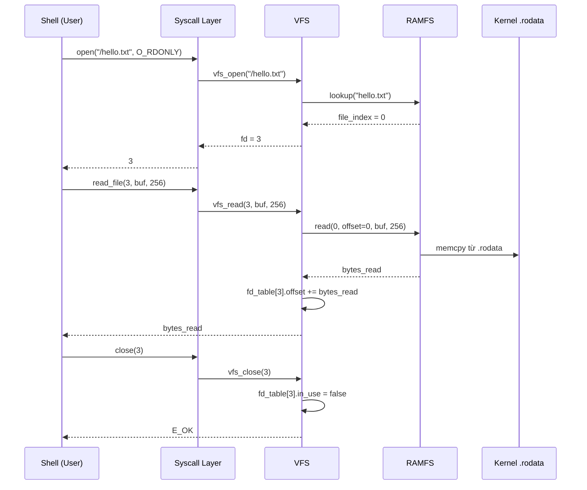

# 07 - Filesystem: VFS và RAMFS

> **Phạm vi:** Kiến trúc 2-layer filesystem — VFS abstraction layer và RAMFS in-memory implementation; cơ chế embed file vào kernel image lúc build.
> **Yêu cầu trước:** [06-syscall-mechanism.md](06-syscall-mechanism.md) — syscalls `open/read/close` là entry point từ user space.
> **Files liên quan:** `kernel/include/vfs.h`, `kernel/src/kernel/fs/vfs.c`, `kernel/src/kernel/fs/ramfs.c`, `kernel/src/kernel/payload.S`, `initfs/`

---

## Kiến Trúc Tổng Quan

```
User Space (Shell)
    │  syscall: open / read / close / listdir
    ▼
VFS Layer          ← abstraction, không biết filesystem cụ thể
    │  vfs_operations function pointers
    ▼
RAMFS              ← in-memory, read-only, file embed lúc build
    │  direct memory access
    ▼
Kernel Image (.rodata)  ← .incbin trong payload.S
```

VFS tách biệt hoàn toàn file operations khỏi filesystem implementation — để sau này có thể mount FAT32 hay ext2 mà không sửa syscall layer.

---

## VFS Layer

File: `VinixOS/kernel/include/vfs.h`, `kernel/src/kernel/fs/vfs.c`

### Interface `vfs_operations`

```c
struct vfs_operations {
    int (*lookup)(const char *name);
    int (*read)(int file_index, uint32_t offset, void *buf, uint32_t len);
    int (*get_file_count)(void);
    int (*get_file_info)(int index, char *name, uint32_t *size);
};
```

> **Tại sao dùng function pointers:** VFS không biết filesystem nào đang mount. Khi gọi `fs_ops->read()`, runtime dispatch đến đúng implementation (RAMFS, FAT32, v.v.).

### File Descriptor Table

```c
#define MAX_FDS 16

struct vfs_fd {
    bool     in_use;
    uint32_t file_index;   /* Index vào ramfs file table */
    uint32_t offset;       /* Current read position     */
};

static struct vfs_fd fd_table[MAX_FDS];
```

> **Lưu ý:** FD 0, 1, 2 reserved cho stdin/stdout/stderr. User FD bắt đầu từ 3.

### Các Operations Chính

**`vfs_open(path, flags)`** — allocate FD, map đến file_index:
```c
int vfs_open(const char *path, int flags) {
    struct vfs_operations *fs_ops = vfs_find_fs(path);
    const char *filename = (*path == '/') ? path + 1 : path;

    int file_index = fs_ops->lookup(filename);
    if (file_index < 0) return E_NOENT;

    /* Tìm FD trống từ slot 3 trở lên */
    int fd = -1;
    for (int i = 3; i < MAX_FDS; i++) {
        if (!fd_table[i].in_use) { fd = i; break; }
    }
    if (fd < 0) return E_MFILE;

    fd_table[fd].in_use     = true;
    fd_table[fd].file_index = file_index;
    fd_table[fd].offset     = 0;
    return fd;
}
```

**`vfs_read(fd, buf, len)`** — đọc và tự động tăng offset:
```c
int vfs_read(int fd, void *buf, uint32_t len) {
    if (fd < 0 || fd >= MAX_FDS || !fd_table[fd].in_use)
        return E_BADF;

    struct vfs_operations *fs_ops = vfs_find_fs("/");
    int bytes_read = fs_ops->read(
        fd_table[fd].file_index,
        fd_table[fd].offset, buf, len);

    if (bytes_read > 0)
        fd_table[fd].offset += bytes_read;
    return bytes_read;
}
```

**`vfs_close(fd)`** — giải phóng FD slot:
```c
int vfs_close(int fd) {
    if (fd < 0 || fd >= MAX_FDS || !fd_table[fd].in_use)
        return E_BADF;
    fd_table[fd].in_use = false;
    return E_OK;
}
```

---

## RAMFS

File: `VinixOS/kernel/src/kernel/fs/ramfs.c`

### File Table

```c
#define MAX_RAMFS_FILES 16

struct ramfs_file {
    const char    *name;
    const uint8_t *data;   /* Pointer vào .rodata của kernel */
    uint32_t       size;
};

static struct ramfs_file file_table[MAX_RAMFS_FILES];
static uint32_t          file_count = 0;
```

Files là **read-only** — `data` trỏ trực tiếp vào kernel image (.rodata), không copy.

### Cơ Chế Embed File vào Kernel

Build-time pipeline để đưa file vào RAMFS:

```
initfs/hello.txt
initfs/info.txt
    │
    ▼  (scripts/generate_ramfs_table.py)
kernel/build/ramfs_payload.S    ← .incbin directives
kernel/build/ramfs_generated.c  ← ramfs_init() đăng ký files
kernel/build/ramfs_generated.h
    │
    ▼  (compiler)
kernel.bin                      ← files nằm trong .rodata
```

> **Để thêm file mới:** Chỉ cần đặt file vào `VinixOS/initfs/` và build lại. Script tự động generate code đăng ký.

**Ví dụ `ramfs_payload.S` được generate:**
```asm
.section .rodata
.align 4

.global _file_hello_txt_start
.global _file_hello_txt_end
_file_hello_txt_start:
    .incbin "hello.txt"
_file_hello_txt_end:
```

**`ramfs_init()` được generate:**
```c
extern uint8_t _file_hello_txt_start[];
extern uint8_t _file_hello_txt_end[];

int ramfs_init(void) {
    file_count = 0;
    ramfs_register_file("hello.txt",
        _file_hello_txt_start,
        _file_hello_txt_end - _file_hello_txt_start);
    return E_OK;
}
```

### RAMFS Operations

**`lookup(name)`** — linear search theo tên:
```c
static int ramfs_lookup(const char *name) {
    for (int i = 0; i < file_count; i++) {
        if (strcmp(file_table[i].name, name) == 0)
            return i;
    }
    return E_NOENT;
}
```

**`read(file_index, offset, buf, len)`** — memcpy từ .rodata:
```c
static int ramfs_read(int file_index, uint32_t offset,
                      void *buf, uint32_t len) {
    if (file_index < 0 || file_index >= file_count) return E_BADF;
    struct ramfs_file *f = &file_table[file_index];
    if (offset >= f->size) return 0;  /* EOF */

    uint32_t available = f->size - offset;
    uint32_t to_read   = (len < available) ? len : available;
    memcpy(buf, f->data + offset, to_read);
    return to_read;
}
```

### Mount vào VFS

```c
/* kernel/src/kernel/fs/ramfs.c */
static struct vfs_operations ramfs_ops = {
    .lookup         = ramfs_lookup,
    .read           = ramfs_read,
    .get_file_count = ramfs_get_file_count,
    .get_file_info  = ramfs_get_file_info,
};

/* kernel_main() */
vfs_init();
ramfs_init();
vfs_mount("/", ramfs_get_operations());
```

---

## Shell Commands

### `ls` — liệt kê file

```c
void cmd_ls(void) {
    file_info_t entries[16];
    int count = listdir("/", entries, 16);
    if (count < 0) { write("Error listing directory\n", 24); return; }

    for (int i = 0; i < count; i++) {
        write(entries[i].name, strlen(entries[i].name));
        write("  ", 2);
        char size_buf[16];
        itoa(entries[i].size, size_buf);
        write(size_buf, strlen(size_buf));
        write(" bytes\n", 7);
    }
}
```

### `cat <filename>` — đọc nội dung file

```c
void cmd_cat(const char *filename) {
    int fd = open(filename, O_RDONLY);
    if (fd < 0) { write("File not found\n", 15); return; }

    char buf[256];
    int n;
    while ((n = read_file(fd, buf, sizeof(buf))) > 0)
        write(buf, n);

    close(fd);
}
```

---

## File Access Flow



---

## Tóm Tắt

| Concept | Ý Nghĩa |
|---------|---------|
| VFS abstraction | Decouple file operations khỏi filesystem cụ thể — add filesystem mới chỉ cần implement `vfs_operations` |
| RAMFS = read-only | Files embed lúc build vào `.rodata`, không thể modify runtime. Đủ cho reference OS |
| `.incbin` embedding | Assembler directive nhúng binary file vào kernel image — linker symbols cung cấp địa chỉ |
| FD management | VFS duy trì FD table, track `offset` per FD — interface POSIX-like |
| Static allocation | File table cố định, không cần memory allocator |
| Extensible design | Dễ thêm filesystem mới (FAT32, ext2) bằng cách implement `vfs_operations` |
| initfs/ workflow | Đặt file vào `initfs/` → build → tự động có trong RAMFS |

---

## Xem Thêm

- [06-syscall-mechanism.md](06-syscall-mechanism.md) — `open/read/close/listdir` syscall implementations
- [08-userspace-application.md](08-userspace-application.md) — Shell sử dụng filesystem như thế nào
- [02-kernel-initialization.md](02-kernel-initialization.md) — thứ tự init: `vfs_init → ramfs_init → vfs_mount`
